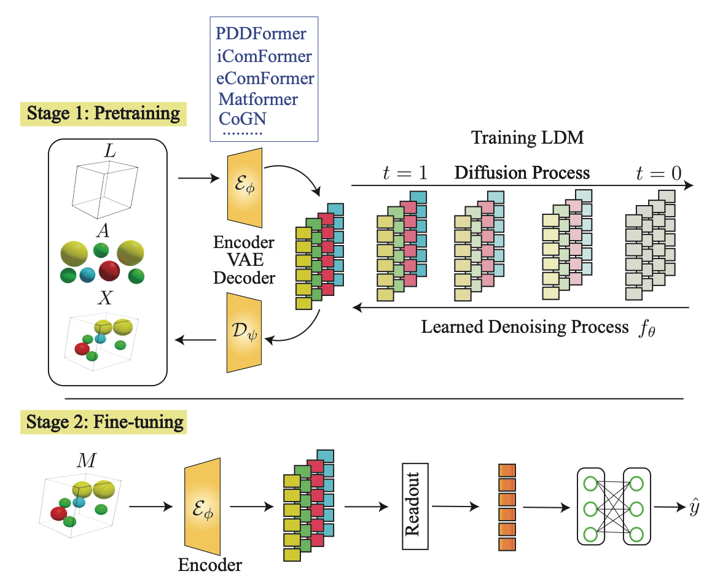

# Latent Diffusion Pretraining for Crystal Property Prediction. (ICML 2026)

This repository contains the official code release for our ICML 2026 paper ["Latent Diffusion Pretraining for Crystal Property Prediction"](https://arxiv.org/pdf/2606.00776), by [Shrimon Mukherjee*](https://www.linkedin.com/in/shrimon-mukherjee-0b816b338/), [Kishalay Das*](https://kdmsit.github.io/), [Partha Basuchowdhuri](https://www.linkedin.com/in/partha-basuchowdhuri-44043a126/) , [Pawan Goyal](https://cse.iitkgp.ac.in/~pawang/), [Niloy Ganguly](https://facweb.iitkgp.ac.in/~niloy/).


# Overview

CrysLDNet is a latent diffusion–based pretraining framework for crystal representation learning. The framework combines:

- A symmetry-preserving VAE encoder for learning compact crystal latent representations
- Latent diffusion modeling in the learned representation space
- Transferable pretrained encoders for downstream crystal property prediction tasks

Our approach is designed to provide scalable and physically meaningful pretraining for materials informatics applications.




## Installation

The list of dependencies is provided in the requirements.txt file, generated using pipreqs. You can install through the following commands:

```bash
# Install PyTorch with CUDA 12.1 first

conda create -n crysldnet python=3.11.13

pip install torch==2.1.0 --index-url https://download.pytorch.org/whl/cu121

pip install pyg_lib torch_scatter torch_sparse -f https://data.pyg.org/whl/torch-2.1.0+cu121.html

pip install  dgl -f https://data.dgl.ai/wheels/torch-2.1/cu121/repo.html

# Then install remaining dependencies
pip install -r requirements.txt

pip install 'numpy<2'

pip install pydantic==1.10.13 --break-system-packages

pip install tqdm==4.66.1 pandas==2.0.3 --break-system-packages

```

🚧 Source code, training scripts, and documentation will be updated shortly. Stay tuned!
